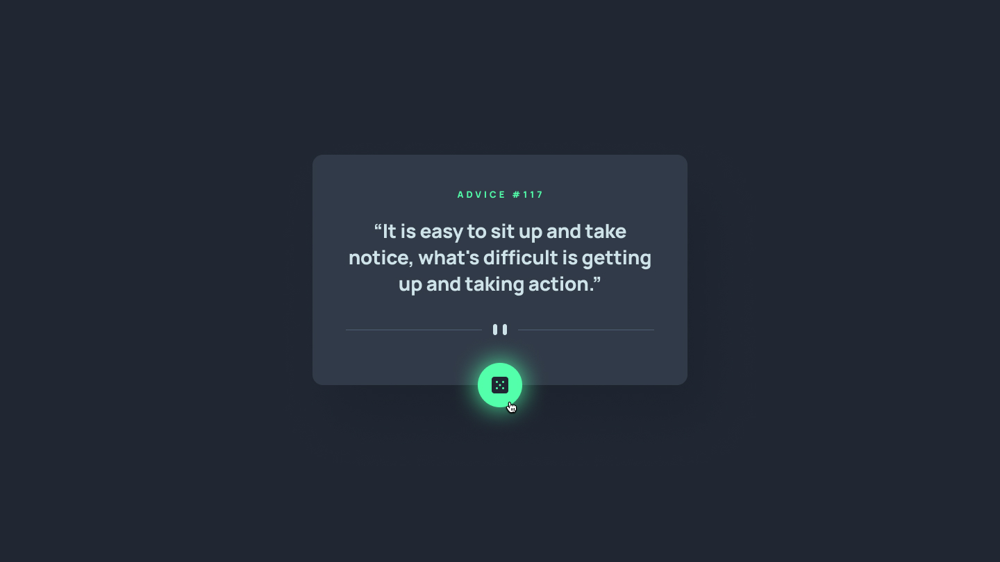
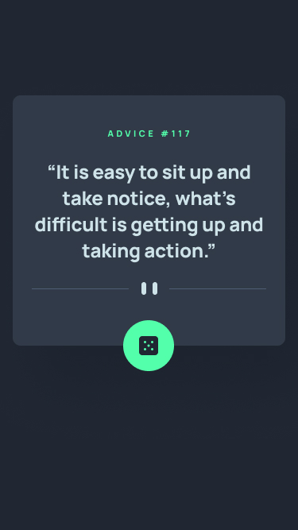

<div align="center">

  <!-- Project Logo / Icon -->
  

# 🎲 Advice Generator App

**A modern, responsive web application that delivers daily wisdom at the click of a button.**

[](https://react.dev/)
[](https://www.typescriptlang.org/)
[](https://tailwindcss.com/)
[](https://vitejs.dev/)
[](LICENSE)

  <br />

<a href="#-live-demo"><strong>View Demo</strong></a> ·
<a href="#-features"><strong>Explore Features</strong></a> ·
<a href="#-quick-start"><strong>Quick Start</strong></a> ·
<a href="#-report-a-bug"><strong>Report Bug</strong></a>

</div>

---

## 📸 Live Preview

<div align="center">

|                                 Desktop View                                  |                                 Mobile View                                  |
| :---------------------------------------------------------------------------: | :--------------------------------------------------------------------------: |
|  |  |

</div>

---

## ✨ Features

- [x] **Instant Advice Generation:** Asynchronous API fetching delivers fresh advice dynamically.
- [x] **Fully Responsive Design:** Dynamic image asset switching (`<picture>` element) seamless across desktop and mobile.
- [x] **Glow Hover Effects:** Custom neon-green glow effects styled using Tailwind CSS arbitrary shadows.
- [x] **Type-Safe Architecture:** Built with React & TypeScript for clean component structures and robust state management.
- [x] **Accessible UI:** Semantic HTML tags, aria-labels, and smooth transition animations.

---

## 🛠️ Tech Stack & API

<details>
  <summary><b>Click to expand Tech Stack details</b></summary>

| Technology                                         | Purpose                                       |
| :------------------------------------------------- | :-------------------------------------------- |
| **[React](https://react.dev/)**                    | UI Component Architecture                     |
| **[TypeScript](https://www.typescriptlang.org/)**  | Static Typing & Interface Definitions         |
| **[Tailwind CSS](https://tailwindcss.com/)**       | Utility-First Styling & Custom Shadows        |
| **[Vite](https://vitejs.dev/)**                    | Lightning Fast Next-Gen Frontend Tooling      |
| **[Advice Slip API](https://api.adviceslip.com/)** | RESTful API endpoint delivering advice quotes |

</details>

---

## 🚀 Quick Start

Follow these steps to get a local development environment running on your machine:

### Prerequisites

Make sure you have **Node.js** (v18+) and your choice of package manager installed (`npm` or `pnpm`).

### Installation

```bash
# 1. Clone the repository
git clone [https://github.com/your-username/advice-generator.git](https://github.com/your-username/advice-generator.git)

# 2. Navigate to project directory
cd advice-generator

# 3. Install dependencies
pnpm install   # or: npm install

# 4. Start the development server
pnpm dev       # or: npm run dev
```
